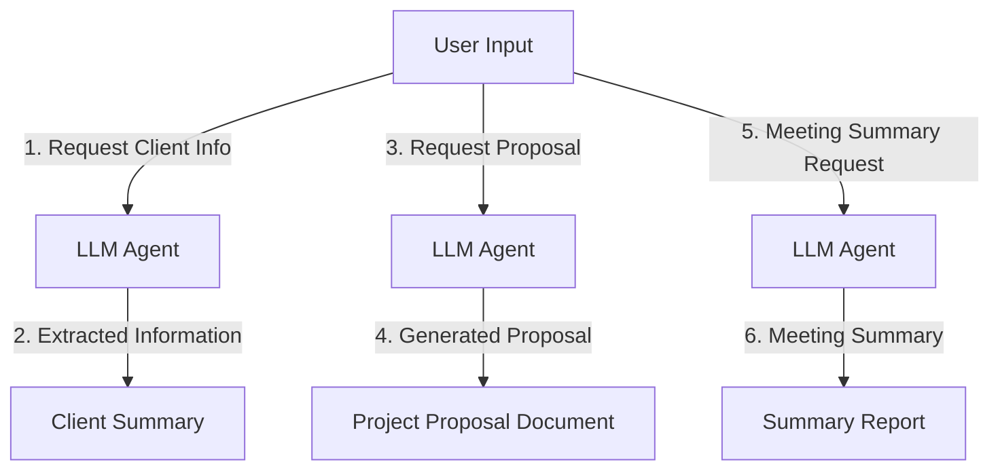

# LLM Agent for Meeting Automation

## Overview
This project demonstrates an LLM-powered agent designed to automate meeting-related workflows. By leveraging NLP and Generative AI, the agent can handle tasks such as client information retrieval, project proposal generation, and meeting summarization, thereby reducing manual effort and enhancing productivity.

### LLM/ APIs used
- **Open AI API**
- **Perplexity API**

### Key Features
- **Client Information Extraction**: Automatically gathers relevant client data for better meeting preparation.
- **Project Proposal Generation**: Generates project proposals based on the context of the meeting.
- **Meeting Summarization**: Summarizes meeting discussions, highlights key points, and prepares action items.

## Workflow

### Flow Diagram
The following diagram illustrates the process flow of the LLM agent:

## Workflow Explanation
- **User Input**: The user initiates the process by providing a request (e.g., retrieving client info, generating a proposal, summarizing a meeting).
- **LLM Agent**: Processes the request using predefined prompts and language models.
- **Extracted Information**: The agent retrieves client-related data or other contextual details based on the input.
- **Generated Proposal**: Prepares a detailed project proposal based on the context of the discussion.
- **Meeting Summary**: Summarizes the meeting, highlighting key discussion points and next steps.

## Use Cases
1. **Sales and Marketing**: Automates the generation of client briefs and project solutions, enabling sales teams to focus on relationship-building.
2. **Project Management**: Documents meeting outcomes, generates project proposals, and tracks progress.
3. **Administrative Support**: Reduces the workload for assistants by automating repetitive documentation and meeting preparation tasks.

## Usage
To run the meeting automation agent:

1. Open `meeting-agent-2.ipynb`.
2. Execute each cell sequentially to interact with the agent.
3. Input your requests for client data, proposals, or meeting summaries as needed.

## Sample Output
- **Client Summary**: This section provides a brief overview of the extracted client information.

- **Project Proposal**: This section generates a detailed project proposal based on the client data and meeting context.

- **Meeting Summary**: This section summarizes key discussion points, decisions, and action items from the meeting.

